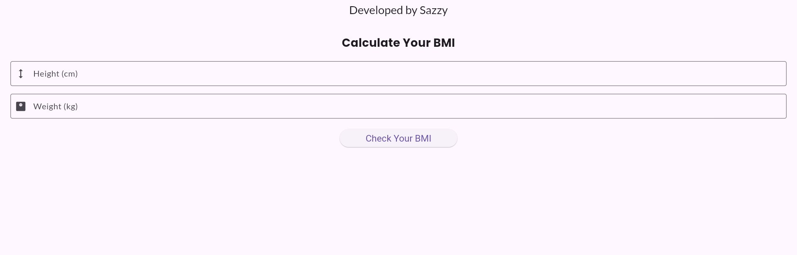

# 📊 BMI Calculator Using Flutter
A simple and user-friendly **Body Mass Index (BMI) Calculator** built using **Flutter**. It allows users to input their height (in cm) and weight (in kg) to calculate their BMI and get health status feedback.

## 🎯 Features
✅ **User-Friendly UI**  
✅ **Real-time BMI Calculation**  
✅ **Error Handling for Invalid Inputs**  
✅ **Stylish Design with Google Fonts**  
✅ **Customizable App Title & Theme**  

---

## 📸 Screenshots  
### ✅ **Home Screen**

### ✅ **Sample Input Data**

### ✅ **Output**

---

